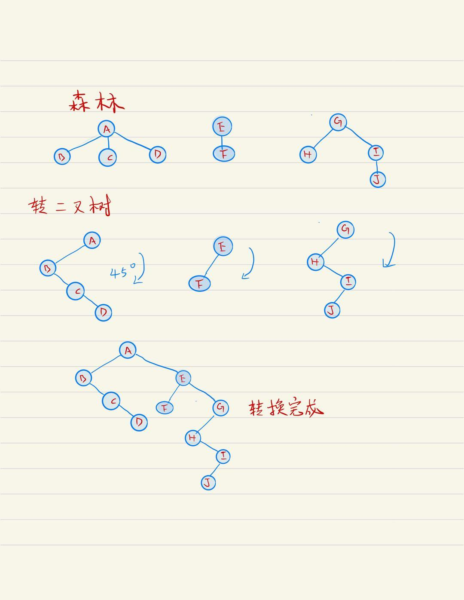
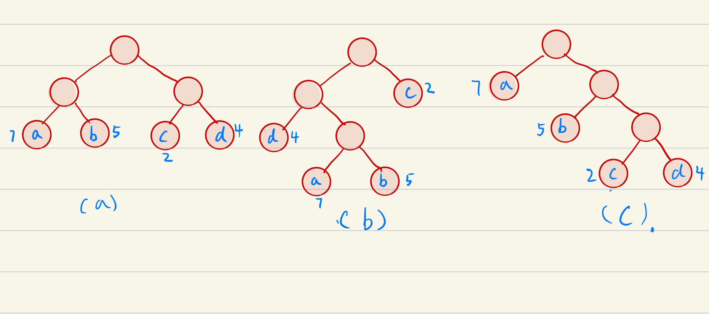
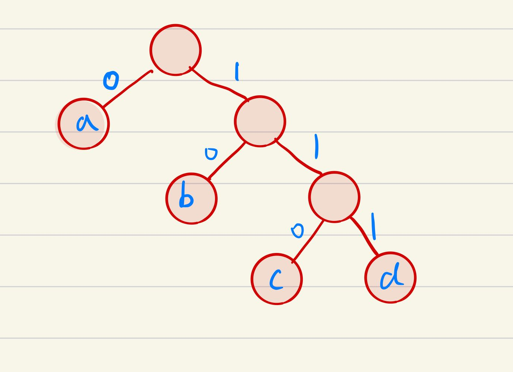

<!--
 * @Author: zhangkangbin
 * @Date: 2022-10-12 12:05:04
 * @LastEditors: zhangkangbin
 * @LastEditTime: 2022-10-15 17:52:25
 * @FilePath: \C_Study\chapter5_tree\tree.md
 * @Description: 
-->

### 树的基本概念

#### 树的定义
- 树是N个结点的有限集。当N=0时，称为空树。在任意一颗非空树中应满足：
1. 有且只有一个特定的节点，称为根的节点。 
2. 除了根节点以外的其余节点可分为 m 个互不相交的有限集。其中每一个集合本身又是一棵树，并且称为根的子树。

#### 树的基本术语

1. 结点：树的独立单元。 

2. 结点的度：结点拥有子树的数称为结点的度。 例如：A结点的度为3，B的结点度为2，D结点的结点度为1.

3. 树的度：

4. 叶子：度为0的结点称为叶子结点或者终端结点。例如：G  H I J F.都是树的叶子结点。

5. 非终端结点：度不为0的结点就称为 非终端结点或者分支结点。

6. 双亲和孩子：结点的子树的根称为该结点的孩子。对应的，该结点称为孩子的双亲。例如：B 双亲是A，A的孩子为 B C.

7. 兄弟：同一个双亲之间互称为兄弟。例如：G H J 双亲都是 D.

8. 祖先：从根到该结点所经历的所有结点。例如 E 的祖先就是 A C E .

9. 子孙：以该结点为根以下的都是子孙，比如 C 结点, E F J都是它的子孙。

10. 层次：从根结点开始算，例如：图中很明显为4层。

11. 堂兄弟：同一层的结点互为堂兄弟，例如 第三层的 D 与E F 。

12. 树的深度：树中结点的最大层次称为深度或者高度。和层次类似。图中为4.

-------------------------------------------------------------

### 二叉树的定义

- 二叉树是另一种树形结构，其特点是每个节点最多只有两棵子树。并且二叉树的子树有左右之分，其次序不能任意颠倒。

#### 4个特殊的二叉树

1. $ 满二叉树：一棵高度为h,且 2^h-1个结点的二叉树，称为满二叉树。 $ 

2. 完全二叉树：高度为 h 有n个结点的二叉树，

-  若有度为1的结点，该结点只有左孩子，而无右孩子。

- 若n为奇数时，每个分支结点都有左右孩子，若n为偶数，则编号最大的分支结点，只有左孩子没有右孩子。其余分支结点，左右孩子都有。

3. 二叉排序树：所有的左子树都小于根结点，所有的右结点都大于根结点。

4. 平衡二叉树：树上任意一结点的左右子树的深度之差不超过1.

### 二叉树的性质（重点）

1. 二叉树第i层上最多有$2^{i-1}$ 个结点，i≥1. 

2. 深度为K的二叉树，最多有$2^k - 1$ 个结点，k≥1. 

3. $ 2i 为该结点的左结点，2i+1为该结点的右孩子。$

### 线索二叉树（没复习）

- 没复习。

### 二叉树与森林之间的转换

- 森林转二叉树
技巧：森林转二叉树，顺时针旋转45°度。

- 二叉树转森林
技巧：二叉树转森林，逆时针旋转45°度。

### 哈夫曼树

- 结点带权路径长度：从树的根到任意结点的路程长度与该结点的乘积。

#### 哈夫曼树的构造

- 三棵二叉树都有4个叶子结点，a , b, c, d,分别带权， 7 ，5 ，2 ，4 。

- 下面是它们的带权路径长度分别：

1. (a)  $7×2+5×2+2×2+4×2=36$

2. (b)  $7×3+5×3+2×1+4×2=46$

3. (c)  $2×3+4×3+5×2+7×1=35$

其中 c 树的 WPL 最小，可以验证它就是哈夫曼树。

#### 哈夫曼树编码

- 各个字符的编码为：
- a :0
- b :10
- c :110
- d :111

- 注意：0 和 1 究竟表示左子树还是右子树没有明确的规定。左右孩子结点的顺序是任意的，所以构造出来的哈夫曼树并不唯一，但各哈夫曼树的带权路径长度WPL相同且最优。
