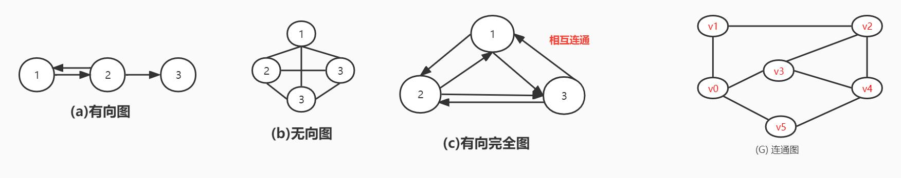
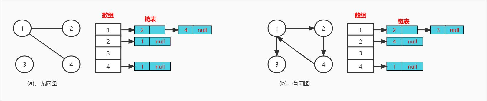
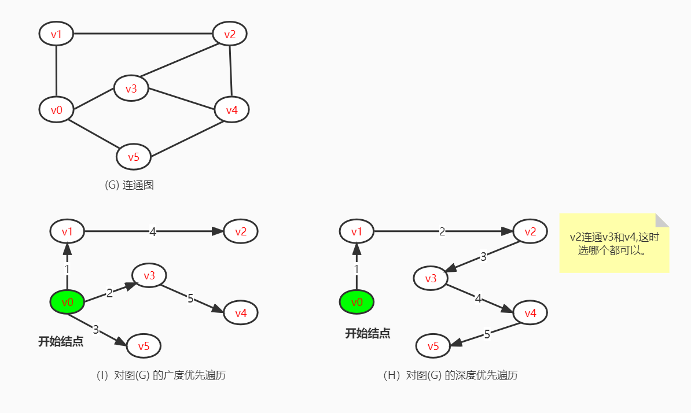
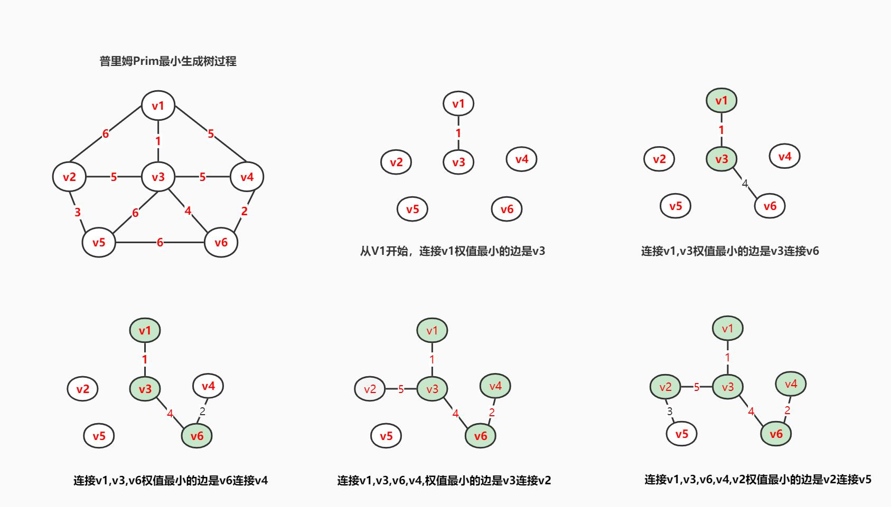
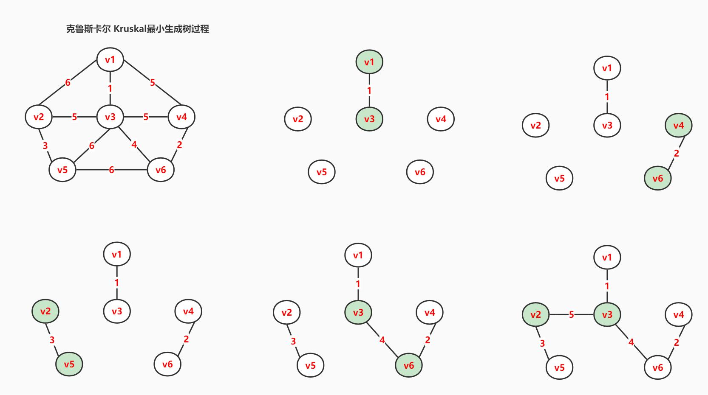
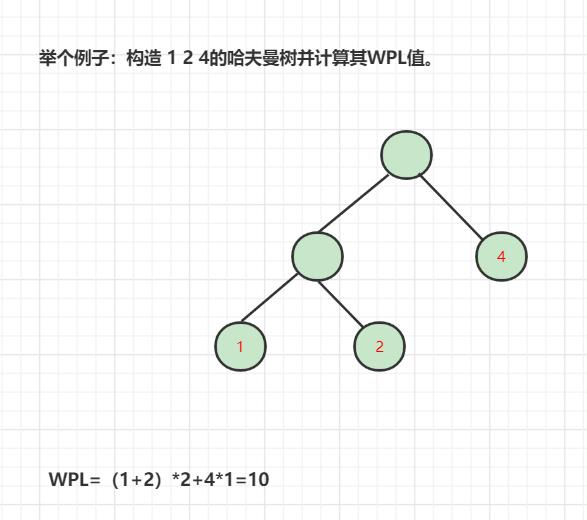

<!--
 * @Author: zhangkangbin
 * @Date: 2022-10-16 13:17:06
 * @LastEditTime: 2022-12-11 12:02:30
 * @FilePath: \C_Study\chapter6_graph\graph.md
-->
### 图


#### 图的定义

#### 图的基本操作

1. 判断图是否有边（重点考）
2. 列出图的所有的边。
3. 插入顶点
4. 删除顶点
5. 获取边的权值。
6. 设置边的权值。

#### 图存储结构的分类

1. 邻接矩阵法（数组实现）

- 结构如下,用的图(a) 无向图
```C++
//修改成有向图,只需要动矩阵。
int mArc[4][4] = {
    //_____1  2  3  4
    /*1*/ {0, 1, 0, 1},
    /*2*/ {1, 0, 0, 0},
    /*3*/ {0, 0, 0, 0},
    /*4*/ {1, 0, 0, 0}

};
```
2. 邻接表法 （链表形的数组）

- 结构如下
```C++
class Node{
    public:
    string name;//顶点名称
    int nameIndex;//顶点下标位置
    Node *nextNode;
};
class Adjacency{
   public:
   Node nodeList[NodeSize];//链表数组
};

```

- 一般这里都是考画图，画结构对应的图形。如图片所示。




#### 图的遍历算法

- 考画图和算法

1. 深度优先遍历（DFS）

2. 广度优先遍历 (BFS)
- 优先访问自己连通的结点。

 * 需要辅助链表，进行退栈进栈。
 * 队形如下：
 -----------
 * a  b c                d
 -----------




#### 图的应用

##### 最小生成树


1. Prim 普里姆 算法
先选择一个结点，再去寻找这个结点连通的最小权值。把这个结点加到集合里面，再从集合里面查找最小的连接边。




2. Kruskal克鲁斯卡尔 算法

先把最小权值的连接起来。




-----------------------------------------

3.WPL 计算


